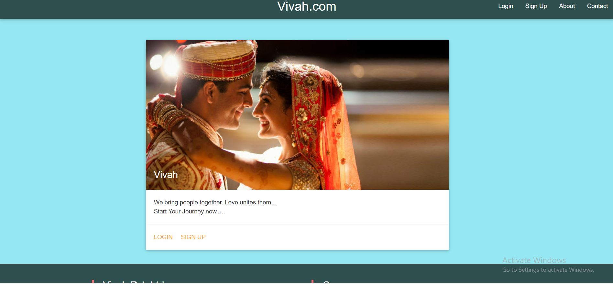

# Vivah.com #

This is the Shaadi.com Clone :ok_hand: , Where You can 
* Login/SignUp :thumbsup:
* Find Matches Based On Your Preferences :clap:
* View Users Profile :clap:
* Add them to favourites :open_hands:
 

 

### `Demo` ###

Demo of this app is Present at https://vivahapp.herokuapp.com

### `Backend` ###

Backend of this app is Built with NodeJS (Express)  
The database in local system is Mysql  
On Production , the database is Postgres  
Sequelize is used as ORM 

### `Frontend` ###

Frontend is built with ReactJS And Materialize is used for CSS

### `How to Start On local System` ###
 * Clone the repository 
 * run `npm install` to install dependencies
 * run `npm run build` to create build folder
 * run `node src/Backend/server.js`
 * go to https://localhost:5000 to view app

 ## `App Info` ##
 #### Created By : Ankit Pahwa
 #### Version : 1.0.0
